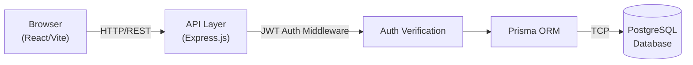
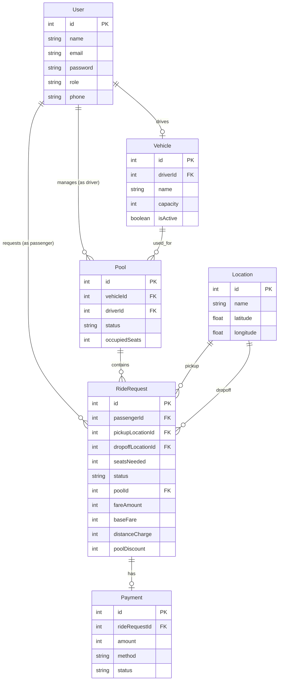
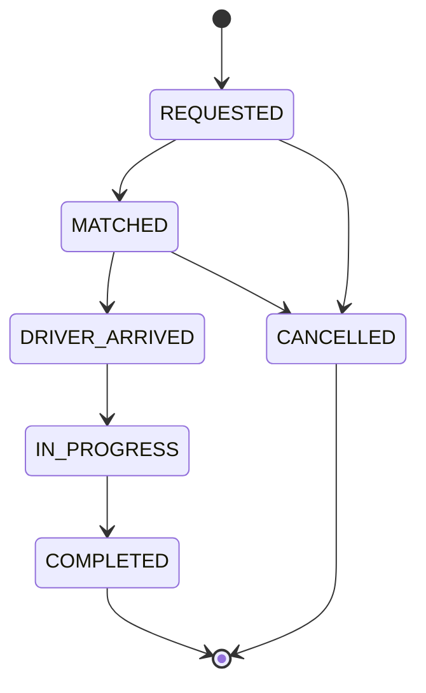
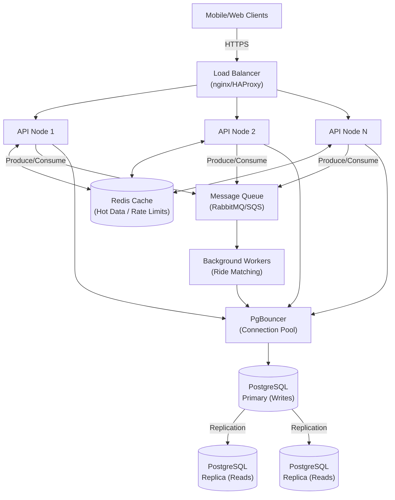

# Dhaka Tesla Pool 🚗⚡

> Share a seat. Split the fare. Survive Dhaka traffic.

## 📋 Summary
Dhaka Tesla Pool is an MVP ride-pooling platform where passengers share electric Tesla rides in Dhaka city. Passengers (Nusrat, Rafiq, Shirin) can request rides across predefined Dhaka zones, and drivers (Jashim with his 3-seat "Bullet") can accept and pool multiple passengers, splitting fares fairly.

## 🎯 Problem Statement
Dhaka traffic is legendary. This platform solves the problem by letting passengers heading in similar directions pool rides in Jashim's Tesla "Bullet" (3-seat capacity). Each passenger gets their own fare with a 20% pool discount, and the system ensures Bullet's capacity is never exceeded — even under concurrent bookings.

## ✨ Features Implemented
- Passenger registration & authentication (JWT)
- Ride request with pickup/destination selection (10+ Dhaka zones)
- Real-time fare estimation with pool discount
- Driver online/offline toggle
- Ride acceptance with automatic pool creation
- Pool capacity enforcement with concurrency protection (PostgreSQL row-level locking)
- Full ride lifecycle: REQUESTED → MATCHED → DRIVER_ARRIVED → IN_PROGRESS → COMPLETED
- Ride cancellation with seat release
- Individual fare per passenger (baseFare + distanceCharge - poolDiscount)
- Payment record creation (Cash / TeslaPay)
- Ride history for both passengers and drivers
- Dark themed UI with GSAP Tesla animations
- Responsive design (mobile + desktop)

## 🎬 Demo Video
[**Watch the 6-minute project walkthrough →**](VIDEO_LINK_HERE)

## 🏗️ Architecture Diagram


## 📊 ERD / Database Schema


## 🛠️ Tech Stack & Justifications

| Technology | Why | Alternative | When to Switch |
|-----------|-----|-------------|----------------|
| PostgreSQL | Relational data, ACID transactions for seat concurrency, FK constraints | MongoDB | Never for this domain |
| Prisma ORM | Type-safe queries, migration system, seed support | Drizzle, Knex | Raw SQL perf at scale |
| Express.js | Simple, widely understood, minimal overhead for MVP | NestJS, Fastify | NestJS for larger teams |
| React (Vite) | Mandated by requirements, Vite for fast DX | Next.js | If SSR/SEO needed |
| JWT + bcrypt | Stateless auth, simple for MVP | Passport.js | Session-based with OAuth |
| Tailwind CSS | Utility-first, rapid styling, dark theme | Styled-components | Complex theming |
| GSAP | Smooth animations for Tesla landing page | Framer Motion | React-native animations |
| Docker Compose | Reproducible deployment | K8s | At scale |
| Vitest + Supertest | Fast testing, Vite-compatible | Jest | Preference only |

## 📁 Project Structure
```text
.
├── client/                 # React/Vite Frontend
│   ├── public/
│   ├── src/
│   │   ├── assets/
│   │   ├── components/
│   │   ├── contexts/
│   │   ├── pages/
│   │   ├── services/
│   │   ├── App.jsx
│   │   └── main.jsx
│   ├── package.json
│   └── vite.config.js
├── server/                 # Express.js Backend
│   ├── prisma/
│   │   ├── migrations/
│   │   ├── schema.prisma
│   │   └── seed.js
│   ├── src/
│   │   ├── controllers/
│   │   ├── middlewares/
│   │   ├── routes/
│   │   ├── services/
│   │   ├── utils/
│   │   └── index.js
│   ├── tests/
│   └── package.json
├── docker-compose.yml
├── README.md
└── .env.example
```

## 🚀 Getting Started

### Prerequisites
- Node.js v18+
- PostgreSQL 14+
- npm or yarn
- Docker (optional)

### Environment Setup
```bash
cp .env.example .env
# Edit .env with your database credentials
```

### Local Development
```bash
# Backend
cd server
npm install
npx prisma migrate dev
npx prisma db seed
npm run dev

# Frontend (new terminal)
cd client
npm install
npm run dev
```

### Docker
```bash
docker compose up --build
```

### Demo Credentials
| User | Email | Password | Role |
|------|-------|----------|------|
| Jashim | jashim@teslapool.com | password123 | Driver |
| Nusrat | nusrat@teslapool.com | password123 | Passenger |
| Rafiq | rafiq@teslapool.com | password123 | Passenger |
| Shirin | shirin@teslapool.com | password123 | Passenger |

## 💰 Fare Model
The fare calculation follows a standardized formula:
```
passengerFare = baseFare + distanceCharge - poolDiscount

baseFare = 3000 poysha (30.00 BDT)
distanceCharge = distance_km × 1500 poysha/km
poolDiscount = 20% of (baseFare + distanceCharge) when pooling
```

> [!NOTE] 
> Money is stored as `INTEGER` (poysha) in the database to avoid floating-point precision issues in JavaScript. 100 poysha = 1 BDT.

**Example Calculations:**
- **Nusrat** travels 5km. Base: 3000, Distance: 7500. Total without pool: 10500. If pooled, 20% discount applies (2100). Final Fare: 8400 poysha (84 BDT).
- **Rafiq** travels 10km. Base: 3000, Distance: 15000. Total without pool: 18000. If pooled, 20% discount applies (3600). Final Fare: 14400 poysha (144 BDT).

## 🔒 Concurrency Handling
**The Bullet Problem:** There is only 1 seat left in the pool. Nusrat and Shirin both try to claim it at the exact same millisecond. If we do a simple read, both see 1 seat available, and both get accepted, exceeding the vehicle capacity.

**Solution:** We use PostgreSQL `SELECT ... FOR UPDATE` row-level locking inside a database transaction. 

```ts
// Using Prisma raw query for row-level locking
const result = await prisma.$executeRaw`
  SELECT "occupiedSeats" FROM "Pool" 
  WHERE "id" = ${poolId} 
  FOR UPDATE;
`;
// If available, update seats and commit
```

**At Larger Scale:** As the app grows, `SELECT FOR UPDATE` might cause contention and bottlenecks. We would eventually switch to Optimistic Locking (versioning rows), Redis Distributed Locks, or a Queue-based matching worker (like Kafka/RabbitMQ) to handle seat allocation asynchronously.

## 🔄 Ride Lifecycle


## 🧪 Testing
The following core mechanics are tested using Vitest + Supertest:
- **Fare calculations:** Verifying Nusrat and Rafiq's pooled and unpooled fares matching the formula exactly in poysha.
- **Pool capacity:** Guaranteeing Bullet's 3-seat limit is respected under normal loads.
- **State transitions:** Ensuring invalid transitions (e.g., IN_PROGRESS → MATCHED) are rejected.
- **Auth:** Registration, login generation, and protected routes blocking unauthorized access.
- **Concurrent booking:** Simulating simultaneous requests to verify only one passenger gets the last seat, while the other is gracefully rejected.

**How to run tests:**
```bash
cd server && npm test
```

## 📡 API Overview

| Method | Path | Auth | Description |
|--------|------|------|-------------|
| POST | `/api/auth/register` | No | Register a new user |
| POST | `/api/auth/login` | No | Authenticate user & get JWT |
| GET | `/api/users/me` | Yes | Get current user profile |
| POST | `/api/rides/request` | Yes (Pass) | Request a new ride |
| GET | `/api/rides` | Yes | List user's rides (or available for Driver) |
| POST | `/api/rides/:id/match` | Yes (Driver) | Match passenger to a pool |
| PUT | `/api/rides/:id/status` | Yes | Update ride status |
| POST | `/api/rides/:id/cancel` | Yes | Cancel a ride and free up seats |
| GET | `/api/pools/active` | Yes | Get currently active pools |

## 🌐 Deployment
- **Live App:** [https://dhaka-tesla-pool-project.vercel.app](https://dhaka-tesla-pool-project.vercel.app)
- **Backend API:** [https://dhaka-tesla-pool-api-j28j.onrender.com/api/health](https://dhaka-tesla-pool-api-j28j.onrender.com/api/health)
- **Frontend:** Vercel (React/Vite static build)
- **Backend:** Render.com (Node.js/Express Web Service)
- **Database:** Render PostgreSQL (free tier)

> **Note:** The backend runs on Render's free tier and may take ~30 seconds to wake up on first visit after inactivity.

*(Alternatively, use the Docker-based deployment documented above for local hosting.)*

## ⚖️ Key Decisions & Trade-offs
1. **PostgreSQL over MongoDB:** Relational data fits naturally, ACID transactions needed for seat locking.
2. **Integer poysha over decimal:** Avoids JavaScript floating-point bugs entirely.
3. **Predefined Dhaka zones over real geocoding:** Keeps MVP simple, clearly documents matching rules.
4. **Pool discount at 20% flat:** Simple, testable, easy to explain.
5. **SELECT FOR UPDATE over optimistic locking:** Simpler for MVP, works well at small scale.
6. **JWT over sessions:** Stateless, simpler deployment.

## 🚧 Known Limitations
- No real-time WebSocket updates (polling-based).
- No actual map/routing integration.
- Single driver demo (Jashim only in seed data).
- No real payment gateway (simulated Cash/TeslaPay).
- No email verification.

## 🔮 Future Improvements
- Real-time ride tracking with WebSockets/SSE
- Google Maps integration for actual routing
- Multi-driver matching algorithm
- Rating system for drivers and passengers
- Push notifications
- Payment gateway integration (bKash, Nagad)

## 🤖 AI Usage
- **Tools used:** GitHub Copilot, Claude AI
- **What for:** Code scaffolding, boilerplate generation, debugging
- **Accepted suggestion:** Using Prisma's `$executeRaw` with `SELECT FOR UPDATE` for concurrency-safe seat locking — the AI suggested this pattern and it was the right approach for PostgreSQL row-level locking.
- **Rejected/Changed suggestion:** AI initially suggested using MongoDB with atomic operations for seat management. Rejected in favor of PostgreSQL because the data is inherently relational (users ↔ rides ↔ pools ↔ vehicles) and PostgreSQL ACID transactions provide stronger guarantees for the concurrency problem.

## 📊 Scaling Thoughts (Bonus)
If Oi Tesla Goes Viral — scaling to 1M passengers and 100k drivers:
- **Load balancing:** nginx/HAProxy
- **Horizontal scaling:** PM2 cluster mode or Kubernetes pods
- **Database:** Read replicas for query distribution, Connection pooling with PgBouncer
- **Caching:** Redis for hot data (driver locations, fare estimates)
- **Geospatial:** PostGIS for location queries at scale
- **Asynchronous:** Message queues (RabbitMQ/SQS) for ride matching
- **Real-time:** WebSockets via Socket.io with Redis adapter
- **Rate limiting:** express-rate-limit + Redis store
- **Observability:** Prometheus + Grafana
- **Resiliency:** Circuit breakers for external service calls

### Scaled Architecture Diagram


## 🏷️ Git Workflow
- `feature/*` branches for each feature
- `master` as integration branch
- `pre-release` for stabilization
- `release/v1.0.0` for final submission

---
*Built with ❤️ for Dhaka's traffic.*
